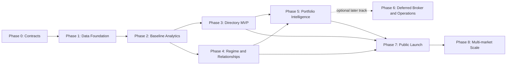

# DNA Strategy Directory — Implementation Workflow

**Workflow status:** `[NOT STARTED]`  
**Owner:** `[TBD]`  
**Last updated:** `[YYYY-MM-DD]`  
**Target release:** `[TBD]`

## 1. How to use and render this workflow

Render each phase as a horizontal lane and each `WF-*` workstream as a clickable node. Directed edges come from `Depends on`. A node detail panel should show status, owner, steps, acceptance criteria, evidence, outputs, risks and blockers. Provide phase/status filters, critical-path highlighting, progress totals, links to evidence, and printable/exportable views.

Status vocabulary: `[NOT STARTED]`, `[IN PROGRESS]`, `[BLOCKED]`, `[IN REVIEW]`, `[DONE]`, `[DEFERRED]`. A node is `[DONE]` only when all acceptance criteria pass and evidence links exist.

## 2. Global completion rules

- Canonical ID is `DNA_nnnnnn`; `_S`/`_B` are ignored for identity and retained only in source lineage.
- Historical metrics use `combined_trades_closed`; current state uses `combined_trades_open`.
- Outcome comes from `net_return`, never `close_type`; costs are not deducted twice.
- Non-DNA never enters the directory population.
- Every metric/score has source, formula, version, as-of window, sample size, sufficiency and tests.
- Every workflow node produces linked, reviewable evidence.

## 3. Phase 0 — Product, contracts, and governance

### WF-001 — Baseline requirements and traceability

- **Status:** `[NOT STARTED]`
- **Owner:** `[TBD]`
- **Depends on:** none
- **Steps:** approve scope; map requirements to workstreams, schemas, endpoints, screens and tests; record assumptions and exclusions.
- **Acceptance:** every requirement in the main specification has an implementation/test owner and release phase; unresolved semantics are explicit blockers.
- **Outputs/evidence:** `[traceability matrix]`, `[scope approval]`, `[decision log]`.

### WF-002 — Canonical identity and source contracts

- **Status:** `[NOT STARTED]`
- **Owner:** `[TBD]`
- **Depends on:** WF-001
- **Steps:** specify normalization; validate examples and collisions; contract closed/open schemas; confirm exit-time precedence, currencies, update behaviour and cost semantics; define Non-DNA isolation.
- **Acceptance:** automated contract tests cover `_S`/`_B`, invalid IDs, duplicate GUIDs, outcome, timestamps and no cost double-counting.
- **Outputs/evidence:** `[data contract]`, `[contract tests]`, `[source-owner sign-off]`.

### WF-003 — Metric dictionary and methodology governance

- **Status:** `[NOT STARTED]`
- **Owner:** `[TBD]`
- **Depends on:** WF-001, WF-002
- **Steps:** define formulas/units/edge cases; define sample sufficiency; select windows/calendars/timezone; define methodology version/change process.
- **Acceptance:** no ambiguous return/drawdown/ratio term; golden expected values approved; percentage metrics have valid denominators.
- **Outputs/evidence:** `[metric dictionary]`, `[golden dataset]`, `[methodology policy]`.

### WF-004 — Regime definition and anti-bias protocol

- **Status:** `[NOT STARTED]`
- **Owner:** `[TBD]`
- **Depends on:** WF-003
- **Steps:** choose objective directional/volatility rules, market features, lookbacks, thresholds and `UNKNOWN`; freeze version before inspecting strategy outcomes; define validation.
- **Acceptance:** regimes are reproducible, use no future data and are independent of DNA results.
- **Outputs/evidence:** `[regime specification]`, `[leakage tests]`, `[version approval]`.

### WF-005 — Security, compliance, and public/private boundary

- **Status:** `[NOT STARTED]`
- **Owner:** `[TBD]`
- **Depends on:** WF-001
- **Steps:** threat model; classify fields/endpoints; roles; disclosures; retention; broker credential controls; incident responsibilities.
- **Acceptance:** public contract excludes restricted data; high-risk flows have controls/owners; broker activation requirements are explicit.
- **Outputs/evidence:** `[threat model]`, `[data classification]`, `[disclosure approval]`, `[risk register]`.

## 4. Phase 1 — Data foundation

### WF-101 — Strategy registry and immutable definitions

- **Status:** `[NOT STARTED]`
- **Owner:** `[TBD]`
- **Depends on:** WF-002
- **Steps:** create master/alias/definition lineage schemas; implement lifecycle and definition hash; seed 300–500 fixed strategies when authorized.
- **Acceptance:** no normalized collisions; definition changes cannot silently reuse an ID; descriptive names can change without analytics impact.
- **Outputs/evidence:** `[migrations]`, `[seed manifest]`, `[identity test report]`.

### WF-102 — Raw/canonical ingestion

- **Status:** `[NOT STARTED]`
- **Owner:** `[TBD]`
- **Depends on:** WF-002, WF-101
- **Steps:** incremental closed/open ingestion; watermarks; canonical views; idempotency; timezone/precision normalization; quarantine.
- **Acceptance:** repeated run has no duplicates; invalid records isolate with replay path; closed/open data cannot cross analytical roles.
- **Outputs/evidence:** `[pipeline code]`, `[run manifest]`, `[idempotency test]`, `[quarantine sample]`.

### WF-103 — Data-quality reconciliation

- **Status:** `[NOT STARTED]`
- **Owner:** `[TBD]`
- **Depends on:** WF-102
- **Steps:** counts/P&L checks; required/range/schema/freshness rules; dashboards and alerts; backfill validation.
- **Acceptance:** source-to-canonical totals reconcile within documented precision; failed gates prevent publish.
- **Outputs/evidence:** `[DQ rules]`, `[reconciliation report]`, `[alert test]`.

### WF-104 — Market and regime data foundation

- **Status:** `[NOT STARTED]`
- **Owner:** `[TBD]`
- **Depends on:** WF-004
- **Steps:** instrument/calendar master; market feed; feature computation; regime observations; quality/coverage.
- **Acceptance:** timestamp joins are deterministic and leakage-free; missing market state becomes `UNKNOWN`.
- **Outputs/evidence:** `[market data contract]`, `[coverage report]`, `[regime fixtures]`.

### WF-105 — Non-DNA research warehouse boundary

- **Status:** `[NOT STARTED]`
- **Owner:** `[TBD]`
- **Depends on:** WF-002, WF-005
- **Steps:** document isolated warehouse and permitted what-if/validation interfaces; add lineage labels and access controls.
- **Acceptance:** no public directory query or metric can include Non-DNA; research output is visibly distinct.
- **Outputs/evidence:** `[boundary tests]`, `[research API/design]`, `[access review]`.

## 5. Phase 2 — Baseline analytics and serving layer

### WF-201 — Strategy headline analytics

- **Status:** `[NOT STARTED]`
- **Owner:** `[TBD]`
- **Depends on:** WF-003, WF-102, WF-103
- **Steps:** implement stats schema; outcome/return/holding/excursion/equity/drawdown calculations; quality metadata; versioned snapshot publish.
- **Acceptance:** golden and independent spot checks pass; no open trade or duplicated cost in historical metrics; edge cases return correct null/status.
- **Outputs/evidence:** `[stats migration]`, `[calculation code]`, `[golden report]`, `[reconciliation]`.

### WF-202 — Period and rolling analytics

- **Status:** `[NOT STARTED]`
- **Owner:** `[TBD]`
- **Depends on:** WF-201
- **Steps:** daily/weekly/monthly series; rolling metrics; consistency/concentration components; complete/incomplete periods.
- **Acceptance:** calendar/timezone boundary fixtures pass; period sums reconcile to headline windows.
- **Outputs/evidence:** `[period tables]`, `[boundary tests]`, `[sample charts]`.

### WF-203 — Score calibration

- **Status:** `[NOT STARTED]`
- **Owner:** `[TBD]`
- **Depends on:** WF-201, WF-202, population history available
- **Steps:** inspect distributions; cohort rules; calibrate consistency/risk/activity/direction balance; freeze thresholds/version; stability tests.
- **Acceptance:** empirical, documented thresholds; no premature qualitative labels; raw components displayed.
- **Outputs/evidence:** `[distribution report]`, `[score spec]`, `[stability validation]`, `[approval]`.

### WF-204 — APIs and read models

- **Status:** `[NOT STARTED]`
- **Owner:** `[TBD]`
- **Depends on:** WF-201, WF-202, WF-005
- **Steps:** versioned strategy/list/detail/period/open endpoints; pagination/filter/sort; error/quality metadata; OpenAPI; authorization/rate limits.
- **Acceptance:** contract, authorization and load tests pass; every response states as-of, basis and methodology.
- **Outputs/evidence:** `[OpenAPI]`, `[contract tests]`, `[performance report]`.

### WF-205 — Cache, search, and performance

- **Status:** `[NOT STARTED]`
- **Owner:** `[TBD]`
- **Depends on:** WF-204
- **Steps:** indexes/read models; query cache keys; atomic publish/invalidation; short open-state TTL; budgets/SLO dashboards.
- **Acceptance:** stale snapshot cannot survive invalidation beyond policy; p95 targets pass representative load.
- **Outputs/evidence:** `[query plans]`, `[load test]`, `[cache correctness test]`, `[SLO dashboard]`.

## 6. Phase 3 — Directory MVP

### WF-301 — Directory listing and discovery

- **Status:** `[NOT STARTED]`
- **Owner:** `[TBD]`
- **Depends on:** WF-204, WF-205
- **Steps:** list/cards; filters/sort/pagination; saved/shareable search; quality/freshness; compare selection; responsive/accessibility states.
- **Acceptance:** users can find strategies by evidence-based constraints; no opaque best ranking; empty/loading/error/stale/insufficient states work.
- **Outputs/evidence:** `[screenshots]`, `[journey tests]`, `[accessibility report]`.

### WF-302 — Individual strategy screen

- **Status:** `[NOT STARTED]`
- **Owner:** `[TBD]`
- **Depends on:** WF-202, WF-204
- **Steps:** overview; equity/drawdown/period/distribution; BUY/SELL; holding/MFE/MAE; open trades; methodology and warnings.
- **Acceptance:** displayed metrics reconcile to API/golden fixtures; `target reached` never implies win; historical/open state visibly separated.
- **Outputs/evidence:** `[screenshots]`, `[UI/API reconciliation]`, `[E2E test]`.

### WF-303 — Compare, watchlist, and explanation pattern

- **Status:** `[NOT STARTED]`
- **Owner:** `[TBD]`
- **Depends on:** WF-301, WF-302
- **Steps:** side-by-side comparison; saved items; explanation/evidence drawers; methodology links; export/share.
- **Acceptance:** every derived value exposes source/window/sample/version/limitations; comparison uses compatible units/windows.
- **Outputs/evidence:** `[comparison demo]`, `[explanation checklist]`, `[user test]`.

## 7. Phase 4 — Regime and relationship intelligence

### WF-401 — Regime analytics

- **Status:** `[NOT STARTED]`
- **Owner:** `[TBD]`
- **Depends on:** WF-104, WF-201
- **Steps:** as-of regime join; regime stats/lift/confidence; sufficiency thresholds; strategy UI/API integration.
- **Acceptance:** no look-ahead; sparse states say collecting/insufficient; results reconcile to fixed fixtures.
- **Outputs/evidence:** `[regime tables]`, `[leakage test]`, `[coverage/stability report]`, `[UI evidence]`.

### WF-402 — Aligned strategy return series

- **Status:** `[NOT STARTED]`
- **Owner:** `[TBD]`
- **Depends on:** WF-202
- **Steps:** choose interval/calendar/no-trade policy; build aligned series and overlap quality; incremental/versioned refresh.
- **Acceptance:** asynchronous trade rows are never directly correlated; alignment fixtures and overlap thresholds pass.
- **Outputs/evidence:** `[alignment spec]`, `[series dataset]`, `[fixture report]`.

### WF-403 — Correlation, downside, and drawdown overlap

- **Status:** `[NOT STARTED]`
- **Owner:** `[TBD]`
- **Depends on:** WF-402
- **Steps:** pairwise correlation; downside correlation; joint loss/drawdown duration/severity; subperiod/regime stability; confidence and suppression.
- **Acceptance:** canonical pair uniqueness; thin/unstable pairs suppressed or warned; independent calculation validates samples.
- **Outputs/evidence:** `[relationship schema]`, `[validation notebook/report]`, `[quality dashboard]`.

### WF-404 — Complementarity, clusters, and discovery

- **Status:** `[NOT STARTED]`
- **Owner:** `[TBD]`
- **Depends on:** WF-403, WF-203
- **Steps:** version composite diversification score; cluster similar strategies; expose closest/complementary results and component rationale.
- **Acceptance:** ranking is reproducible, robust to reasonable windows and never justified by a single opaque score.
- **Outputs/evidence:** `[score spec]`, `[robustness report]`, `[relationship UI/API]`.

## 8. Phase 5 — Portfolio intelligence

### WF-501 — Portfolio requirements and capital model

- **Status:** `[NOT STARTED]`
- **Owner:** `[TBD]`
- **Depends on:** WF-003, WF-404
- **Steps:** define capital, sizing, currency, margin, constraints/objectives, eligibility and baseline portfolios.
- **Acceptance:** no percentage/capital claim lacks denominator/sizing policy; infeasible requests explain why.
- **Outputs/evidence:** `[portfolio contract]`, `[constraint matrix]`, `[baseline definitions]`.

### WF-502 — Portfolio search and optimizer

- **Status:** `[NOT STARTED]`
- **Owner:** `[TBD]`
- **Depends on:** WF-501
- **Steps:** diversified selection; equal/risk-balanced then constrained optimization; reproducible run manifest; exclusions and sensitivity.
- **Acceptance:** no highest-return shortcut; solution obeys all constraints and is reproducible from version/seed/inputs.
- **Outputs/evidence:** `[engine]`, `[run manifests]`, `[constraint tests]`.

### WF-503 — Portfolio validation

- **Status:** `[NOT STARTED]`
- **Owner:** `[TBD]`
- **Depends on:** WF-502, WF-401
- **Steps:** walk-forward/holdout; regime/scenario tests; benchmark equal weight/simple selection; bias and sensitivity review.
- **Acceptance:** no leakage/survivorship failure; risks and baseline comparisons presented; promotion gate approved.
- **Outputs/evidence:** `[validation report]`, `[bias checklist]`, `[promotion decision]`.

### WF-504 — Portfolio builder UI and API

- **Status:** `[NOT STARTED]`
- **Owner:** `[TBD]`
- **Depends on:** WF-502, WF-503, WF-303
- **Steps:** input constraints; candidate solutions; allocation/risk/contribution/charts; rationale/exclusions; save/share/export.
- **Acceptance:** a user can build and understand a feasible portfolio; warnings and evidence persist with saved runs.
- **Outputs/evidence:** `[screenshots]`, `[E2E journeys]`, `[API contract]`, `[user test]`.

## 9. Phase 6 — Deferred broker/platform integration and operations

This phase is an optional post-launch track. It does not block the initial research-directory, analytics, discovery, relationship-intelligence or portfolio-intelligence release.

### WF-601 — Broker abstraction and sandbox

- **Status:** `[DEFERRED]`
- **Owner:** `[TBD]`
- **Depends on:** WF-005, WF-501
- **Steps:** broker capabilities/instrument mapping; credential vault; sandbox adapter; order/execution event model.
- **Acceptance:** secrets never enter client/logs; supported/unsupported capabilities explicit; sandbox contract tests pass.
- **Outputs/evidence:** `[adapter contract]`, `[sandbox report]`, `[secret review]`.

### WF-602 — Deployment preview and risk gates

- **Status:** `[DEFERRED]`
- **Owner:** `[TBD]`
- **Depends on:** WF-504, WF-601
- **Steps:** account mapping/sizing; preview; explicit confirmation; exposure/loss/staleness/duplicate/price gates; pause/kill.
- **Acceptance:** no activation without confirmation; each simulated fault blocks safely; limitations/cost basis clear.
- **Outputs/evidence:** `[preview UI]`, `[risk test suite]`, `[approval audit]`.

### WF-603 — Execution reconciliation and monitoring

- **Status:** `[DEFERRED]`
- **Owner:** `[TBD]`
- **Depends on:** WF-602
- **Steps:** idempotent intents; ack/fill/reject/cancel reconciliation; drift detection; heartbeats/alerts; incident runbooks.
- **Acceptance:** duplicate/retry/disconnect scenarios reconcile; alert and kill-control drills pass.
- **Outputs/evidence:** `[reconciliation report]`, `[failure drills]`, `[runbooks]`, `[dashboards]`.

### WF-604 — Strategy lifecycle operations

- **Status:** `[DEFERRED]`
- **Owner:** `[TBD]`
- **Depends on:** WF-103, WF-201, WF-603
- **Steps:** collecting/eligible/active/paused/retired/quarantined rules; drift/staleness/definition mismatch flags; approval and audit.
- **Acceptance:** pausing stops new deployment without deleting history; every transition is authorized/auditable.
- **Outputs/evidence:** `[state-machine tests]`, `[operator UI]`, `[audit samples]`.

## 10. Phase 7 — Quality, beta, and public launch

### WF-701 — Full test and analytical assurance

- **Status:** `[NOT STARTED]`
- **Owner:** `[TBD]`
- **Depends on:** WF-303, WF-401, WF-404, WF-504
- **Steps:** unit/property/integration/contracts; independent analytics; UI/accessibility/cross-browser; load/recovery.
- **Acceptance:** release thresholds pass; defects triaged; required regression suite automated.
- **Outputs/evidence:** `[test reports]`, `[analytical sign-off]`, `[accessibility/load reports]`.

### WF-702 — Security and operational readiness

- **Status:** `[NOT STARTED]`
- **Owner:** `[TBD]`
- **Depends on:** WF-005, WF-701
- **Steps:** directory security review; permissions/abuse testing; monitoring/on-call/runbooks; backup/restore and incident exercise; apply broker-specific readiness gates only if the deferred broker track is later activated.
- **Acceptance:** no open critical/high issue; restore and incident drills pass; owners/SLAs defined.
- **Outputs/evidence:** `[security report]`, `[restore drill]`, `[on-call/runbook approval]`.

### WF-703 — Private beta and evidence review

- **Status:** `[NOT STARTED]`
- **Owner:** `[TBD]`
- **Depends on:** WF-701, WF-702
- **Steps:** invite cohort; measure journeys and comprehension; inspect unsupported interpretations; tune UX, not historical outcomes.
- **Acceptance:** users can explain why results/suggestions appear; material trust/usability issues resolved.
- **Outputs/evidence:** `[beta report]`, `[feedback decisions]`, `[launch recommendation]`.

### WF-704 — Public launch and rollback

- **Status:** `[NOT STARTED]`
- **Owner:** `[TBD]`
- **Depends on:** WF-703
- **Steps:** staged traffic; final disclosures/support; dashboards; rollback test; go/no-go; post-launch review.
- **Acceptance:** SLOs/data quality stable at target load; rollback proven; launch approval recorded.
- **Outputs/evidence:** `[go/no-go]`, `[release record]`, `[live dashboards]`, `[post-launch review]`.

## 11. Phase 8 — Multi-market expansion

### WF-801 — Canonical market adapter framework

- **Status:** `[NOT STARTED]`
- **Owner:** `[TBD]`
- **Depends on:** WF-704
- **Steps:** market/venue/instrument/contract/calendar/currency abstractions; adapter conformance tests.
- **Acceptance:** FX remains unchanged; new market maps without special-casing core analytics.
- **Outputs/evidence:** `[adapter SDK/spec]`, `[conformance suite]`.

### WF-802 — Futures/crypto pilot

- **Status:** `[NOT STARTED]`
- **Owner:** `[TBD]`
- **Depends on:** WF-801
- **Steps:** select one liquid pilot; validate feeds, sessions, tick/contract value, costs, sizing, regimes and disclosures; private beta.
- **Acceptance:** market-specific calculations reconcile and pass the same quality/security/trust gates.
- **Outputs/evidence:** `[pilot report]`, `[calculation reconciliation]`, `[promotion decision]`.

## 12. Critical path and dependency notes

Critical path: `WF-001 -> WF-002 -> WF-003 -> WF-101 -> WF-102 -> WF-103 -> WF-201 -> WF-202 -> WF-204 -> WF-301/WF-302 -> WF-303 -> WF-701 -> WF-702 -> WF-703 -> WF-704`.

Regime branch: `WF-004 -> WF-104 -> WF-401`. Relationship branch: `WF-202 -> WF-402 -> WF-403 -> WF-404`. Both feed the portfolio branch `WF-501 -> WF-502 -> WF-503 -> WF-504`. Broker deployment is deferred and is not advertised as part of the initial research-directory launch. If activated later, `WF-601–603` become mandatory dependencies for that broker-enabled release only.

## 13. Programme dashboard placeholders

| Phase | Status | Owner | Planned | Actual | Done/Total | Evidence | Blocker |
|---|---|---|---|---|---:|---|---|
| 0 Contracts | `[NOT STARTED]` | `[TBD]` | `[date]` | `[date]` | 0/5 | `[link]` | `[none]` |
| 1 Foundation | `[NOT STARTED]` | `[TBD]` | `[date]` | `[date]` | 0/5 | `[link]` | `[none]` |
| 2 Analytics | `[NOT STARTED]` | `[TBD]` | `[date]` | `[date]` | 0/5 | `[link]` | `[none]` |
| 3 Directory MVP | `[NOT STARTED]` | `[TBD]` | `[date]` | `[date]` | 0/3 | `[link]` | `[none]` |
| 4 Intelligence | `[NOT STARTED]` | `[TBD]` | `[date]` | `[date]` | 0/4 | `[link]` | `[none]` |
| 5 Portfolio | `[NOT STARTED]` | `[TBD]` | `[date]` | `[date]` | 0/4 | `[link]` | `[none]` |
| 6 Broker/Ops | `[DEFERRED]` | `[TBD]` | `[later release]` | `[date]` | 0/4 | `[link]` | `[not an initial-launch dependency]` |
| 7 Launch | `[NOT STARTED]` | `[TBD]` | `[date]` | `[date]` | 0/4 | `[link]` | `[none]` |
| 8 Expansion | `[NOT STARTED]` | `[TBD]` | `[date]` | `[date]` | 0/2 | `[link]` | `[none]` |

## 14. Handoff to the implementation/visual-workflow model

- Parse phases and `WF-*` headings as graph nodes; use `Depends on` for directed edges.
- Preserve IDs and status vocabulary so visual state round-trips to Markdown or a companion JSON/YAML manifest.
- Each visual node must expose the complete steps, acceptance criteria and linked outputs/evidence.
- Implement critical-path, phase, status, owner and blocker filters; node search; progress; deep links; accessible keyboard/detail-panel behaviour; print/export.
- Do not mark nodes complete from code existence alone. Require the stated evidence and acceptance results.
- Implement the directory in the same dependency order and update this file as the auditable programme record.
